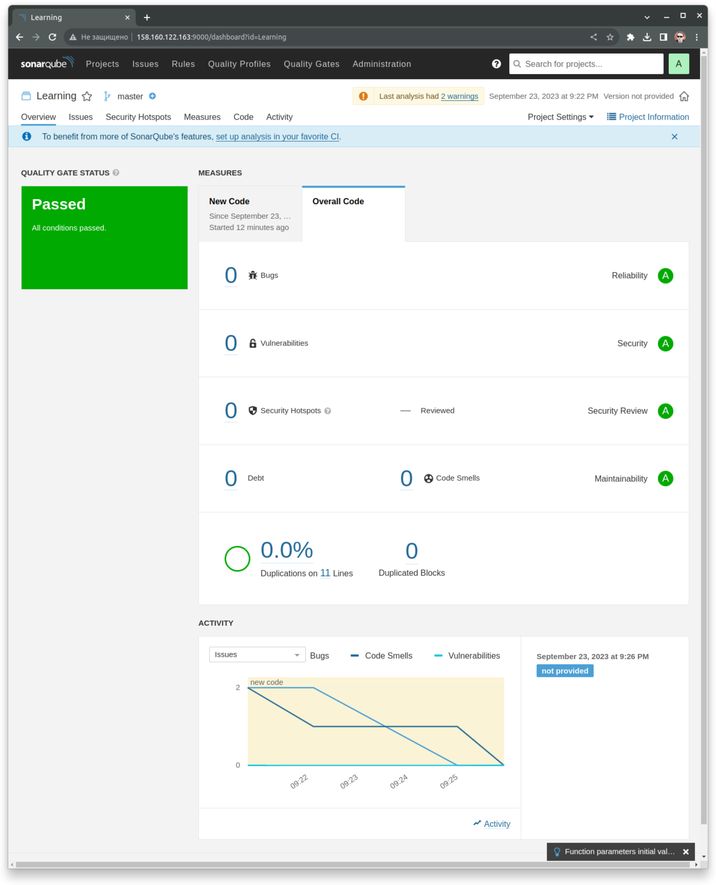
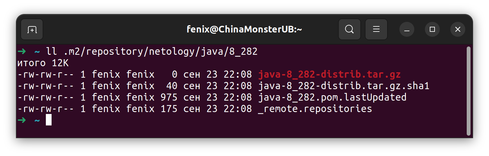

### Знакомство с SonarQube  
- SonarQube развернут  
- Проект создан  
- Пакет sonar-scanner скачан, распакован, добавлен в PATH  
- sonar-scanner --version  
    INFO: Scanner configuration file: /opt/sonar-scanner/conf/sonar-scanner.properties  
    INFO: Project root configuration file: NONE  
    INFO: SonarScanner 5.0.1.3006  
    INFO: Java 17.0.7 Eclipse Adoptium (64-bit)  
    INFO: Linux 6.2.0-33-generic amd64  
- Анализатор запущен  
- Результат - один bug и один code smells  
- Ошибки исправлены  
- Анализатор запущен повторно, вот скриншот:  
  

### Знакомство с Nexus  
Создал два пустых файла для имитации дистрибутивов, загрузил их с указанными параметрами, вот [maven-metadata.xml](files/maven-metadata.xml)  

### Знакомство с Maven  
- Maven скачал, распаковал, закомментировал секцию запрещающую HTTP соединения.  
- mvn --version
    Apache Maven 3.9.4 (dfbb324ad4a7c8fb0bf182e6d91b0ae20e3d2dd9)  
    Maven home: /opt/apache-maven  
    Java version: 11.0.20.1, vendor: Ubuntu, runtime: /usr/lib/jvm/java-11-openjdk-amd64  
    Default locale: ru_RU, platform encoding: UTF-8  
    OS name: "linux", version: "6.2.0-33-generic", arch: "amd64", family: "unix  
- Положил директорию с pom к себе в репозиторий  
- Изменил в [pom.xml](mvn/pom.xml) блок с зависимостями под свой артефакт из задания для Nexus  
- Запустил команду mvn package, всё произошло:  
  
