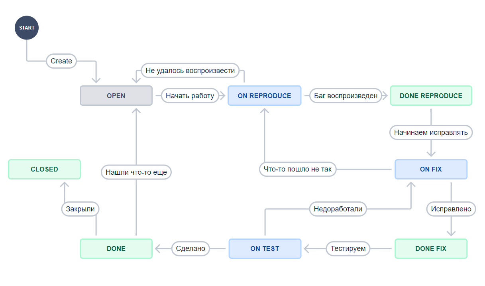
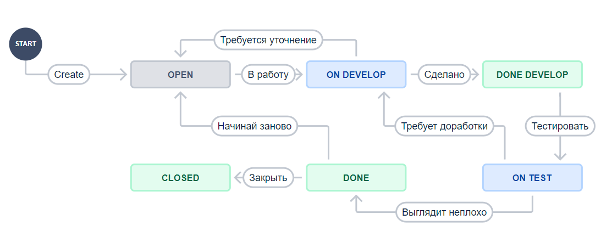

### Описание моих действий  
К сожалению (или счастью) сначала я создал проект типа "team-managed" в результате чего узнал что он отличается от "company-managed" более простой схемой и с ним не получится сделать то что требуется по заданию. Например, создать отдельную доску Scrum или экспортировать workflow.  
Зато его workflow выглядят симпатичнее и нагляднее, их и приложу в качестве скриншотов.  
Это workflow для багов:  
  
Это Epic, Task и другие типы:  
  
Экспортированные в xml файлы workflow здесь: [bug](workflows/Bug.xml), [epic](workflows/Epic.xml)  
