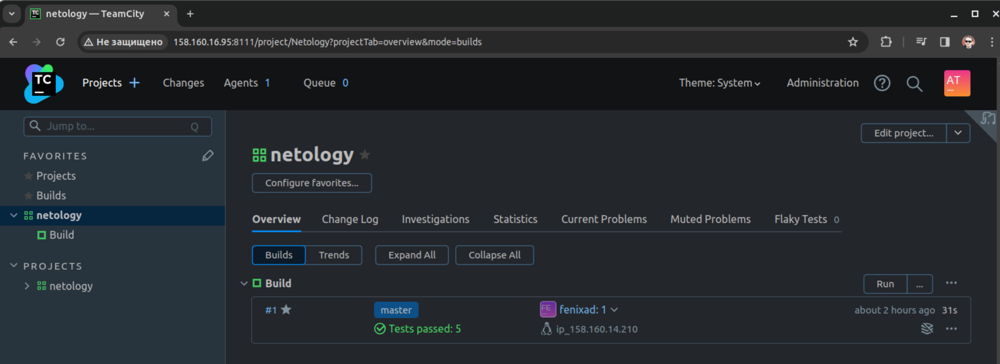
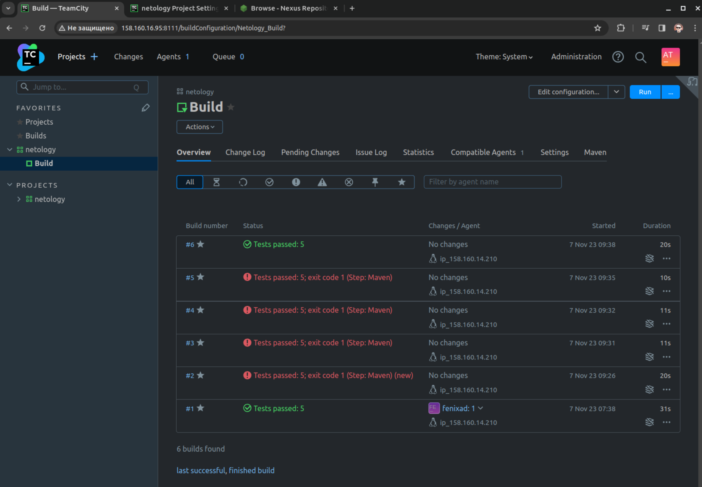
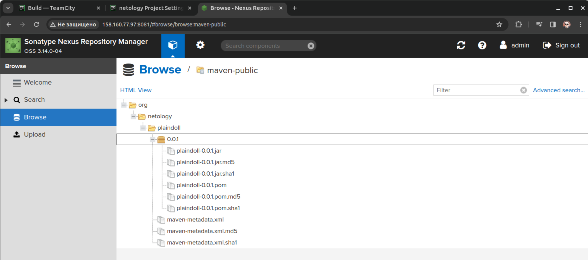
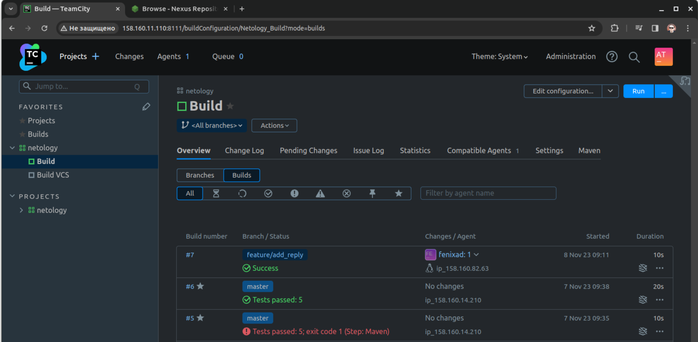
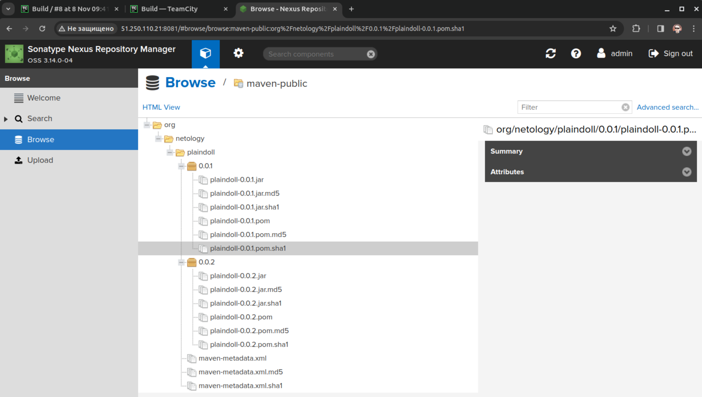

### Подготовка  
- Созданы и запущены необходимые ВМ  
- Выполнена первоначальная настройка Teamcity  
- Сделан fork репозитория  
- Nexus развернут используя приведенный playbook  

### Основная часть  
- Новый проект на основе fork репозитория создан
- Autodetect конфигурации состоялся, первая сборка ветки master запущена  
  
- В файл settings.xml вписан измененный пароль nexus, файл импортирован в Teamcity  
- Условия сборки изменены на "clean deploy" по ветке master  
- После нескольких неудачных попыток изменения файла settings.xml новый запуск отработал без ошибок  
  
- Артефакт появился в nexus  
  
- Мигрировал (включил синхронизацию) проекта с VCS  
- Создал отдельную ветку feature/add_reply в репозитории, написал новый метод содержащий слово hunter, дополнил тест для нового метода  
- Сделал push в новую ветку репозитория, убедился что сборка запустилась самостоятельно и тесты прошли успешно  
  
- Внес изменения из новой ветки в master через Merge  
- Убедился что нового артефакта в сборке по ветке master нет  
- Нет его по двум причинам. Почему-то при запуске в первый раз в файле pom был старый адрес сервера Nexus (он обновился из-за прерывания ВМ), хотя я вписал новый адрес сразу после запуска и изменения ушли вместе с остальными коммитами. При следующих запусках я получил ошибку в моем вольном переводе звучащую как "В репозитории nexus запрещено изменение объектов"  
- Изменил версию на 0.0.2 -> commit -> push -> Pull request -> Merge -> сборка по ветке master и вот результат:  
  
- Конфигурация Teamcity в репозитории находится [здесь](https://github.com/atasenko/example-teamcity/tree/master/.teamcity) и содержит все настройки  
